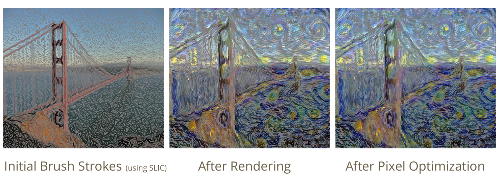
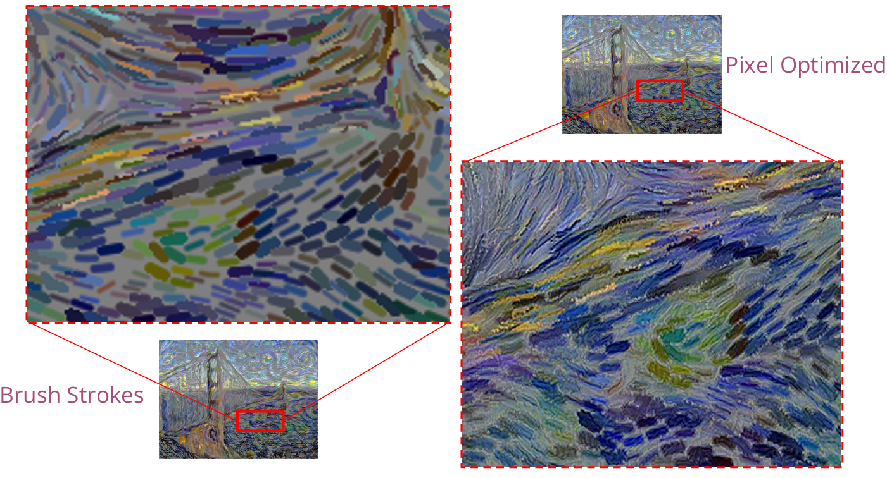
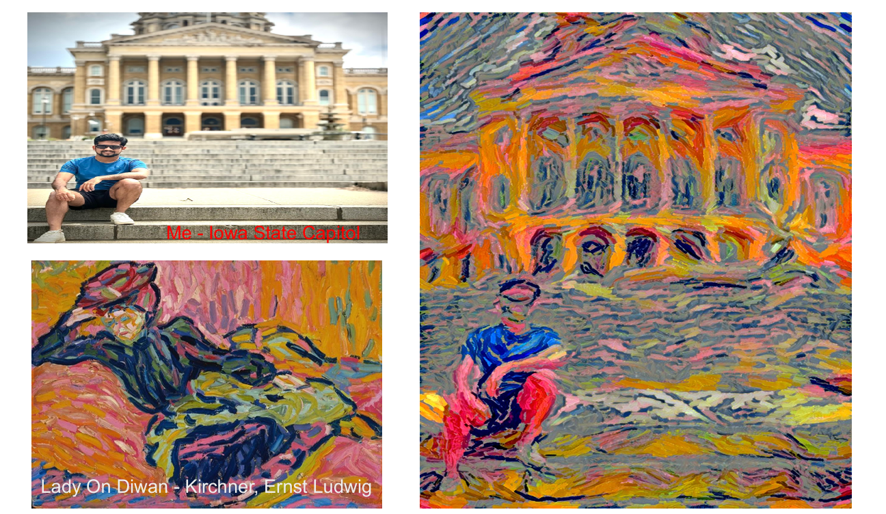
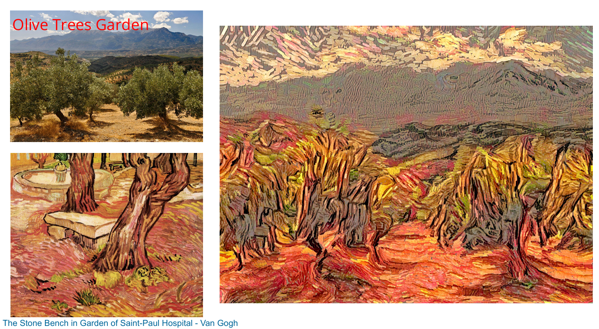

## Abstract

This project, titled "Brush Stroke Parameterized Style Transfer," explores the application of parameterized brush stroke techniques in the field of style transfer. By leveraging advanced algorithms and machine learning models, the project aims to achieve high-quality artistic transformations of images. The implementation is designed to be efficient and user-friendly, providing customizable parameters to control the style transfer process. This work has potential applications in digital art, graphic design, and other creative industries.

## Methodology

## Results

### Video Result

<video width="640" height="480" controls>
  <source src="videos/clemson.mp4" type="video/mp4">
  Your browser does not support the video tag.
</video>

This video demonstrates the application of the brush stroke parameterized style transfer technique on a sample video. The transformation showcases the effectiveness of the algorithm in maintaining high-quality artistic effects.

### Image Results

#### Result 1

This image shows the result of applying the style transfer technique to a bridge scene. Notice the intricate brush strokes and the overall artistic transformation.

#### Result 2

Here, we have a zoomed-in view of the brush strokes applied to a different scene. The details highlight the precision and customization capabilities of the algorithm.

#### Result 3

This image demonstrates the style transfer applied to a portrait. The transformation retains the subject's features while adding an artistic flair.

#### Result 4

In this example, the style transfer is applied to a garden scene. The brush strokes and color adjustments create a visually appealing artistic rendition.