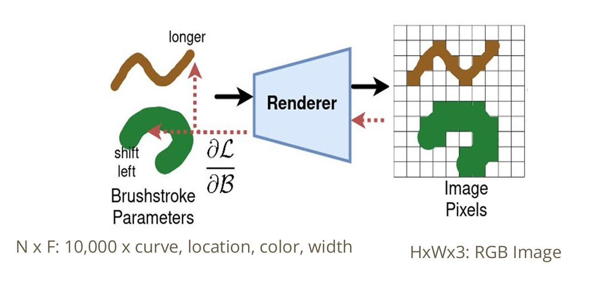

## Abstract

This project, titled "Brush Stroke Parameterized Style Transfer," explores the application of parameterized brush stroke techniques in the field of style transfer. By leveraging advanced algorithms and machine learning models, the project aims to achieve high-quality artistic transformations of images. The implementation is designed to be efficient and user-friendly, providing customizable parameters to control the style transfer process. This work has potential applications in digital art, graphic design, and other creative industries.

## Methodology

## Results

  
  

